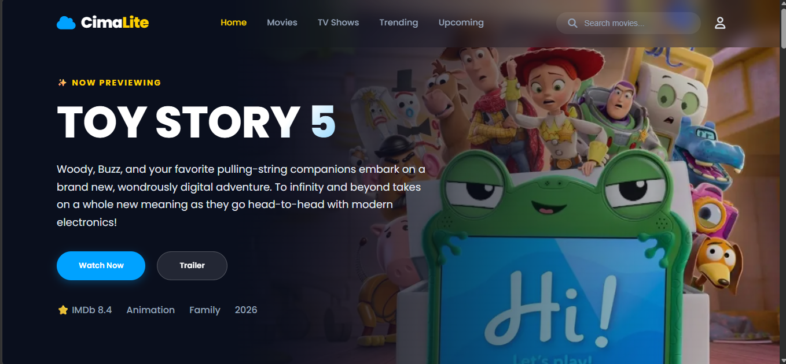

<!-- ========================================================= -->
<!-- MONA HANIYEH - GITHUB PROFILE README                      -->
<!-- ========================================================= -->

<!-- ========================= HERO ========================== -->

 

  
  
  

  <strong>Design it</strong>
  &nbsp; • &nbsp;
  <strong>Code it</strong>
  &nbsp; • &nbsp;
  <strong>Build it</strong>
  &nbsp; ♡

 

<!-- ========================= ABOUT ========================= -->

<table>
<tr>
<td width="100%">

<h2>🌷 &nbsp; About Me</h2>

<table>
<tr>

<td width="58%" valign="top">

I'm <strong>Mona</strong>, a Front-End & Full-Stack Developer
and UI/UX Designer with a background in Software Engineering.

I enjoy building responsive web applications, creating
beautiful interfaces, and turning ideas into real products.

My main focus is creating clean, practical and user-friendly
digital experiences while continuously improving my
software engineering skills.

</td>

<td width="42%" valign="top">

⚙️ &nbsp; Front-End Development

▣ &nbsp; Full-Stack Development (Laravel)

🎨 &nbsp; UI/UX Design

⌘ &nbsp; API Integration

▤ &nbsp; Database Development

♧ &nbsp; Clean Code & Problem Solving

</td>

</tr>
</table>

</td>
</tr>
</table>

 

<!-- ======================= TECH STACK ====================== -->

<table>
<tr>
<td width="100%">

<h2>💻 &nbsp; Tech Stack</h2>

<table>

<tr>

<td width="33%" align="center">

<h3>🌿 Frontend</h3>

  

HTML &nbsp; CSS &nbsp; JavaScript

 

React &nbsp; Tailwind

</td>

<td width="33%" align="center">

<h3>⚙️ Backend</h3>

  

PHP &nbsp; Laravel &nbsp; MySQL

</td>

<td width="33%" align="center">

<h3>◎ Programming</h3>

  

Java

</td>

</tr>

<tr>

<td width="33%" align="center">

<h3>🎨 Design</h3>

  

Figma
 
Framer

</td>

<td width="33%" align="center" colspan="2">

<h3>🛠 Tools</h3>

  

Git &nbsp; GitHub &nbsp; VS Code &nbsp; Postman

</td>

</tr>

</table>

</td>
</tr>
</table>

 

<!-- ====================== WHAT I BUILD ===================== -->

<table>
<tr>

<td width="70%" valign="top">

<h2>🛠️ &nbsp; What I Build</h2>

✓ &nbsp; Responsive web applications

✓ &nbsp; Full-stack Laravel applications

✓ &nbsp; REST APIs

✓ &nbsp; Database-driven systems

✓ &nbsp; Interactive front-end interfaces

✓ &nbsp; Authentication & role-based systems

✓ &nbsp; Real-time features

✓ &nbsp; AI-powered web experiences

</td>

<td width="30%" align="center" valign="middle">

 

<h3>⌁</h3>

 

<em>
Ideas
 
+
 
Code
 
+
 
Real Products
</em>

  

🌷

</td>

</tr>
</table>

 

<!-- ==================== FEATURED PROJECTS ================= -->

<h2 align="center">🚀 &nbsp; Featured Projects</h2>

 

<table>

<tr>

<!-- LAW FIRM -->

<td width="33%" valign="top">

<h3>⚖️ &nbsp; LawFirm</h3>

Legal Management Platform

<strong>View Project →</strong>

</td>

<!-- RIFA -->

<td width="33%" valign="top">

<h3>🌱 &nbsp; RIFA</h3>

AI-Powered Learning Platform

<strong>View Project →</strong>

</td>

<!-- NAJDA -->

<td width="33%" valign="top">

<h3>🚑 &nbsp; Najda AI Emergency</h3>

AI-assisted emergency & first-aid app

<strong>View Project →</strong>

</td>

</tr>

</table>

 

<!-- ================= DEVELOPMENT + STATS ================== -->

<table>
<tr>

<td width="45%" valign="top">

<h2>🎯 &nbsp; Development Focus</h2>

 

<table>

<tr>
<td><strong>Front-End:</strong></td>
<td>Responsive & interactive interfaces</td>
</tr>

<tr>
<td><strong>Full-Stack:</strong></td>
<td>Laravel, APIs, database systems</td>
</tr>

<tr>
<td><strong>Software Engineering:</strong></td>
<td>Architecture & maintainability</td>
</tr>

<tr>
<td><strong>UI/UX:</strong></td>
<td>Usability & better user experiences</td>
</tr>

</table>

 

<h3>My priorities</h3>

✦ Clean architecture

✦ Maintainable code

✦ Better UX

✦ Real-world solutions

</td>

<td width="55%" valign="top">

<h2>📊 &nbsp; GitHub Stats</h2>

 

</td>

</tr>
</table>

 

<!-- ================= CURRENTLY LEARNING =================== -->

<table>
<tr>

<td width="55%" valign="top">

<h2>🌱 &nbsp; Currently Learning</h2>

 

<table>

<tr>
<td width="42%">
Advanced Laravel & Full-Stack Development
</td>
<td>
████████████████░░░░
</td>
</tr>

<tr>
<td>
REST APIs & Backend Integrations
</td>
<td>
███████████████░░░░░
</td>
</tr>

<tr>
<td>
React & Modern Front-End Development
</td>
<td>
██████████████░░░░░░
</td>
</tr>

<tr>
<td>
Database Design
</td>
<td>
█████████████░░░░░░░
</td>
</tr>

<tr>
<td>
Clean Architecture & Best Practices
</td>
<td>
███████████░░░░░░░░░
</td>
</tr>

<tr>
<td>
Android Development (Java)
</td>
<td>
████████░░░░░░░░░░░░
</td>
</tr>

</table>

</td>

<td width="45%" valign="top">

<h2>🎨 &nbsp; UI/UX Design</h2>

 

I enjoy applying design principles to create simple,
useful, and accessible interfaces for better user experiences.

 

 

🌷

</td>

</tr>
</table>

 

<!-- ===================== CIMALITE ========================= -->

<table>
<tr>

<td width="100%" valign="top">

<h2>💡 &nbsp; More Projects</h2>

<table>

<tr>

<td width="50%" valign="top">

<h3>🌐 &nbsp; Cimalite</h3>

A modern digital project focused on creating
a clean and practical user experience.

</td>

<td width="50%" valign="middle">

<h3>✦ Project Philosophy</h3>

I enjoy building projects that combine
<strong>clean code</strong>, <strong>good design</strong>,
and <strong>real-world problem solving</strong>.

 

<strong>Build → Test → Improve → Grow</strong>

 

🌷 &nbsp; <em>Better code. Better ideas. Bigger dreams.</em> &nbsp; 🌷

</td>

</tr>

</table>

</td>
</tr>
</table>

 

<!-- ====================== CONNECT ========================== -->

<table>
<tr>

<td width="100%">

<h2>🔗 &nbsp; Let's Connect</h2>

 

&nbsp;&nbsp;

&nbsp;&nbsp;

 

<strong>Mona Haniyeh</strong>

&nbsp; | &nbsp;

Code

&nbsp; • &nbsp;

Design

&nbsp; • &nbsp;

Build

&nbsp; • &nbsp;

Grow

&nbsp; 🌷

</td>

</tr>
</table>

 

<!-- ======================== FOOTER ======================== -->

  

🌷 Thanks for visiting my profile ♡

