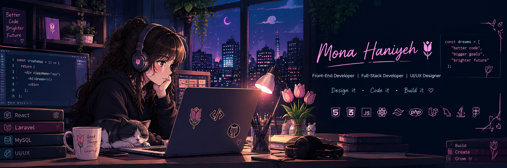
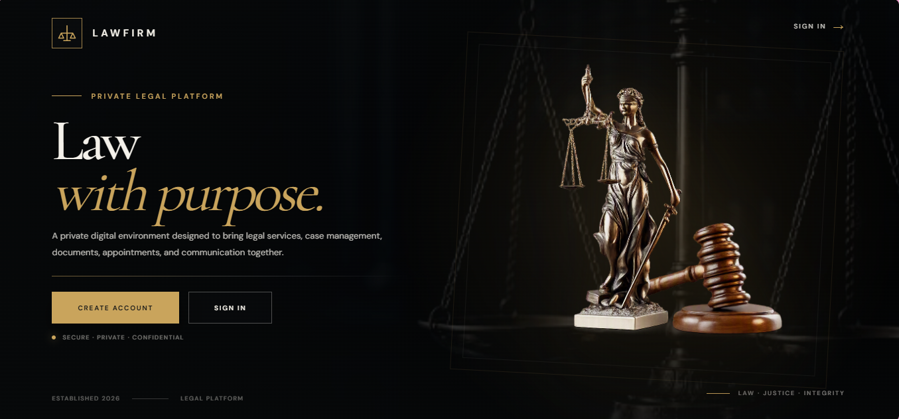
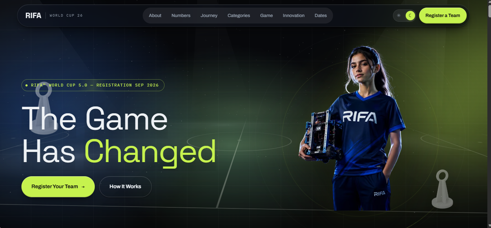

<!-- ============================================================
     PREMIUM GITHUB PROFILE README — @MonaHaniyeh
     Color palette: Deep navy/purple bg (#0d1117 / #1a1b2e)
     Accents: Magenta/Pink (#ff4da6) • Purple (#a374ff) • Teal (#4dd0e1)
     ============================================================ -->

<div align="center">

<!-- Custom banner image -->


<!-- Typing animation -->
<a href="#">
  
</a>

<br/>

<!-- Social badges -->
<a href="https://www.linkedin.com/in/mona-haniyeh">
  
</a>
<a href="https://github.com/MonaHaniyeh">
  
</a>

<br/><br/>


</div>

<br/>

<!-- ================= ABOUT ================= -->


## 🪞 About Me

<table>
<tr>
<td width="58%" valign="top">

Full-Stack Developer and UI/UX Designer with a strong foundation in software
engineering and experience building user-centered web applications using
Laravel, MySQL, React, JavaScript, HTML, CSS, and Tailwind CSS. Skilled in
UI/UX design, prototyping, and usability, with experience integrating AI
tools to accelerate development and deliver clean, responsive, and
functional digital products.

```js
const mona = {
  role: "Full-Stack Developer & UI/UX Designer",
  stack: ["Laravel", "React", "MySQL", "Tailwind"],
  currentFocus: "Full-stack architecture + accessible design",
  dreams: ["better code", "bigger goals", "brighter future"],
};
```

</td>
<td width="42%" valign="top">

**⚡ Quick Facts**

| | |
|---|---|
| 🎨 | Front-End Development |
| 🧩 | Full-Stack Dev (Laravel) |
| 🖌️ | UI/UX Design |
| 🔌 | REST API Integration |
| 🗄️ | Database Architecture |
| 🎓 | B.Sc. Software Engineering |
| 📍 | Amman, Jordan |

</td>
</tr>
</table>

<br/>

<!-- ================= TECH STACK ================= -->


## 🛠️ Tech Stack

<table width="100%">
<tr>
<td align="center" width="20%">

**Frontend**
<br/><br/>


</td>
<td align="center" width="20%">

**Backend**
<br/><br/>


</td>
<td align="center" width="20%">

**Cloud**
<br/><br/>


</td>
<td align="center" width="20%">

**Design**
<br/><br/>


</td>
<td align="center" width="20%">

**Tools**
<br/><br/>


</td>
</tr>
</table>

<br/>

**🤖 AI & Development Tools**
<br/><br/>


<br/>

<!-- ================= WHAT I BUILD ================= -->


## 🚀 What I Build

<table>
<tr>
<td width="50%">

✅ Responsive web applications
<br/>
✅ Full-stack Laravel applications
<br/>
✅ REST APIs & backend systems
<br/>
✅ Database-driven architectures

</td>
<td width="50%">

✅ Interactive front-end interfaces
<br/>
✅ User-centered UI/UX design
<br/>
✅ Prototypes with animation & micro-interactions
<br/>
✅ AI-powered web experiences

</td>
</tr>
</table>

<br/>

<!-- ================= FEATURED PROJECTS ================= -->


## 🧭 Featured Projects

<table>
<tr>
<td width="33%" valign="top">


**⚖️ LawFirm**
<br/>
Legal Management Platform
<br/><br/>


<br/>
[**View Project →**](#)

</td>
<td width="33%" valign="top">


**🌱 RIFA**
<br/>
AI-Powered Learning Platform
<br/><br/>


<br/>
[**View Project →**](#)

</td>
<td width="33%" valign="top">


**🩹 Najda-AI**
<br/>
Intelligent First Aid Assistant for high-pressure moments — built at the Kanz AI Training Hackathon (LAU Academy)
<br/><br/>


<br/>
[**View Project →**](#)

</td>
</tr>
</table>

<br/>

<!-- ================= STATS ================= -->


## 📊 GitHub Analytics

<div align="center">


<br/>


<br/>


</div>

<br/>

<!-- ================= EDUCATION & CERTIFICATIONS ================= -->


<table>
<tr>
<td width="50%" valign="top">

### 🎓 Education & Training

**B.Sc. Software Engineering (IT)**
<br/>
Al-Balqa Applied University — GPA 3.45
<br/>
<sub>Oct 2021 – Jul 2025</sub>

**Full-Stack Laravel Training**
<br/>
Robotna & DigiSkills
<br/>
<sub>May 2026 – Present</sub>

**UI/UX Design**
<br/>
The Hope International Company
<br/>
<sub>Jun 2025 – Sep 2025</sub>

</td>
<td width="50%" valign="top">

### 🏆 Certifications

- AWS Certified Cloud Practitioner — AWS *(Oct 2025)*
- UI/UX Design — The Hope International Company *(Oct 2025)*
- UI/UX Design Training — The Hope International Trading & Investment Co.
- Guinness World Record — AI Training Hackathon
- AI Training Hackathon — Kanz AI, LAU Academy *(Jul 2026)*
- Programming Fundamentals — Hello Gates & JoCodes

**Courses:** Figma UI/UX Essentials & Advanced (Udemy) · AWS Cloud Practitioner Essentials

</td>
</tr>
</table>

<br/>

<!-- ================= FOCUS + LEARNING ================= -->


<table>
<tr>
<td width="50%" valign="top">

### 🎯 Development Focus

| Area | Detail |
|---|---|
| **Front-End** | Responsive & interactive interfaces |
| **Full-Stack** | Laravel, APIs, database systems |
| **Engineering** | Architecture & maintainability |
| **UI/UX** | User-centered design & usability |

</td>
<td width="50%" valign="top">

### 🎨 UI/UX Toolkit

`User-Centered Design` `Personas` `User Flows` `Task Flows` `Wireframing` `Prototyping` `Sketching` `Visual Design` `A/B Testing` `Animation & Micro-interactions`

**🌍 Languages**
<br/>
English (Very Good) · Arabic (Native)

</td>
</tr>
</table>

<br/>

<!-- ================= FOOTER ================= -->


<p align="center">
  <sub>Mona Haniyeh &nbsp;|&nbsp; Code • Design • Build • Grow 🌷</sub>
</p>
