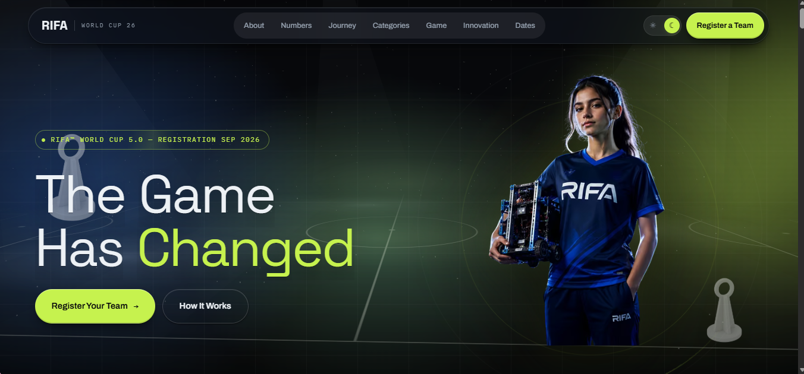
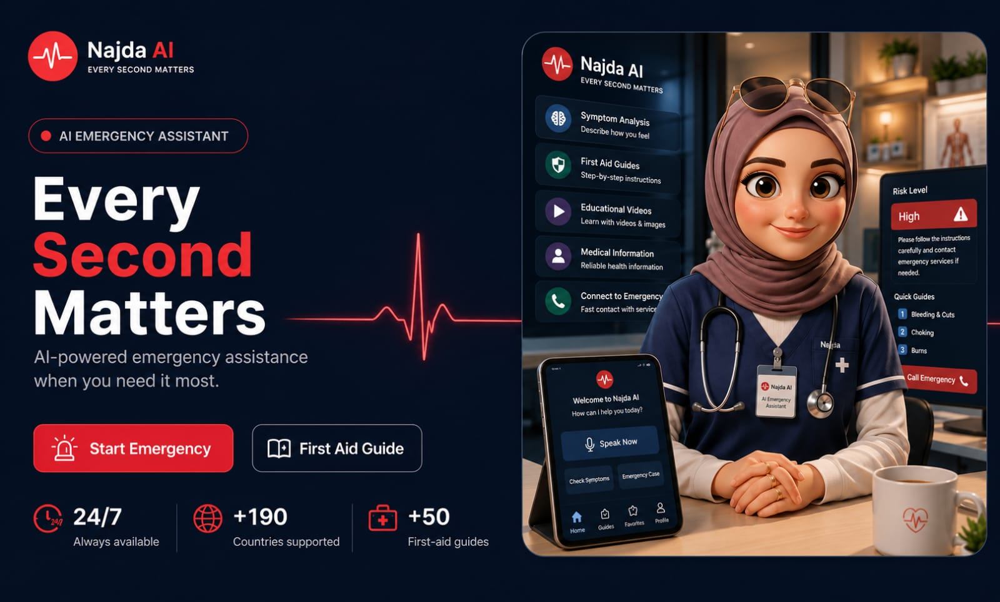
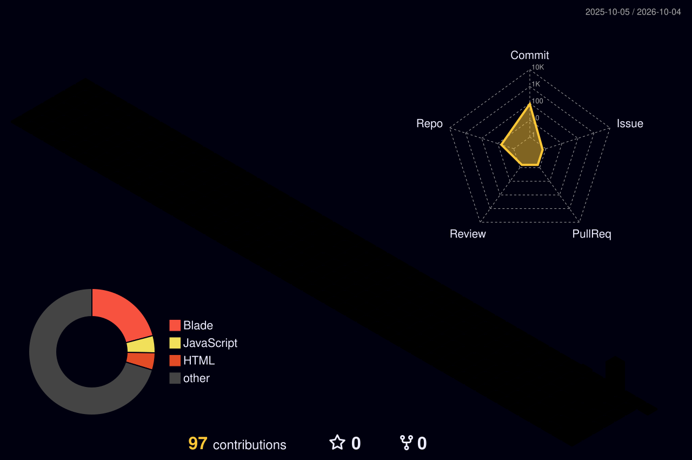

<!-- ============================================================
     ANIMATED GITHUB PROFILE — @MonaHaniyeh
     Fully self-contained SVGs (inline fonts/images, no external
     network calls) + a daily-refreshing 3D contribution city.
     Palette: navy/purple bg · pink #FF4DA6 · purple #A374FF · teal #4DD0E1
     ============================================================ -->

<!-- 1 · HERO -->

 

  

 

<!-- 2 · ABOUT ME (terminal) -->
## 🪞 About Me

 

<!-- 3 · WHAT I BUILD + FOCUS CAROUSEL -->
## 🚀 What I Build

 

<!-- 4 · TECH ORBIT -->
## 🛰️ Tech Stack

**🤖 AI & Development Tools**
  

 

<!-- 5 · ID BADGE + LIVE SNAPSHOT -->
## 🪪 ID Badge & Snapshot

 

<!-- 6 · FEATURED PROJECTS -->
## 🧭 Featured Projects

<table>
<tr>
<td width="33%" valign="top">

**⚖️ LawFirm**
 
Legal Management Platform · Capstone, 98/100 Gold Tier
  

 
[**View Project →**](#)

</td>
<td width="33%" valign="top">

**🌱 RIFA**
 
AI-Powered Learning Platform
  

 
[**View Project →**](#)

</td>
<td width="33%" valign="top">

**🩹 Najda-AI**
 
Intelligent First Aid Assistant — Kanz AI Training Hackathon (LAU Academy)
  

 
[**View Project →**](#)

</td>
</tr>
</table>

 

<!-- 7 · GITHUB ANALYTICS -->
## 📊 GitHub Analytics

 

 

<!-- 8 · 3D CONTRIBUTION CITY (self-hosted, refreshes daily via GitHub Action) -->
## 🌃 Contribution City

<picture>
  <source media="(prefers-color-scheme: dark)" srcset="profile-3d-contrib/profile-night-rainbow.svg">
  <source media="(prefers-color-scheme: light)" srcset="profile-3d-contrib/profile-day-rainbow.svg">
  
</picture>

Generated and committed automatically once a day by a GitHub Action — see Setup notes below.

 

<!-- 9 · EDUCATION & CERTIFICATIONS -->
## 🎓 Education & Certifications

<table>
<tr>
<td width="50%" valign="top">

### 🎓 Education & Training

> **B.Sc. Software Engineering (IT)** · GPA 3.45
> Al-Balqa Applied University
> Oct 2021 – Jul 2025

> **Full-Stack Laravel Training**
> Robotna & DigiSkills
> May 2026 – Present

> **UI/UX Design**
> The Hope International Company
> Jun 2025 – Sep 2025

</td>
<td width="50%" valign="top">

### 🏆 Certifications

> **AWS Certified Cloud Practitioner**
> Amazon Web Services · Oct 2025

> **UI/UX Design**
> The Hope International Company · Oct 2025

> **UI/UX Design Training**
> The Hope Int'l Trading & Investment Co.

> **AI Training Hackathon — Najda-AI**
> Kanz AI × LAU Academy · Jul 2026

> **Guinness World Record**
> AI Training Hackathon

> **Programming Fundamentals**
> Hello Gates & JoCodes

**Courses:** Figma UI/UX Essentials & Advanced (Udemy) · AWS Cloud Practitioner Essentials

</td>
</tr>
</table>

 

<!-- 10 · UI/UX TOOLKIT -->
## 🎨 UI/UX Toolkit

> **Research & Strategy**
>   

> **Design & Prototyping**
>   

> **Validation**
>  

> **🌍 Languages**
> English (Very Good) · Arabic (Native)

 

<!-- 11 · CONNECT -->

  Mona Haniyeh &nbsp;|&nbsp; Code • Design • Build • Grow 🌷

